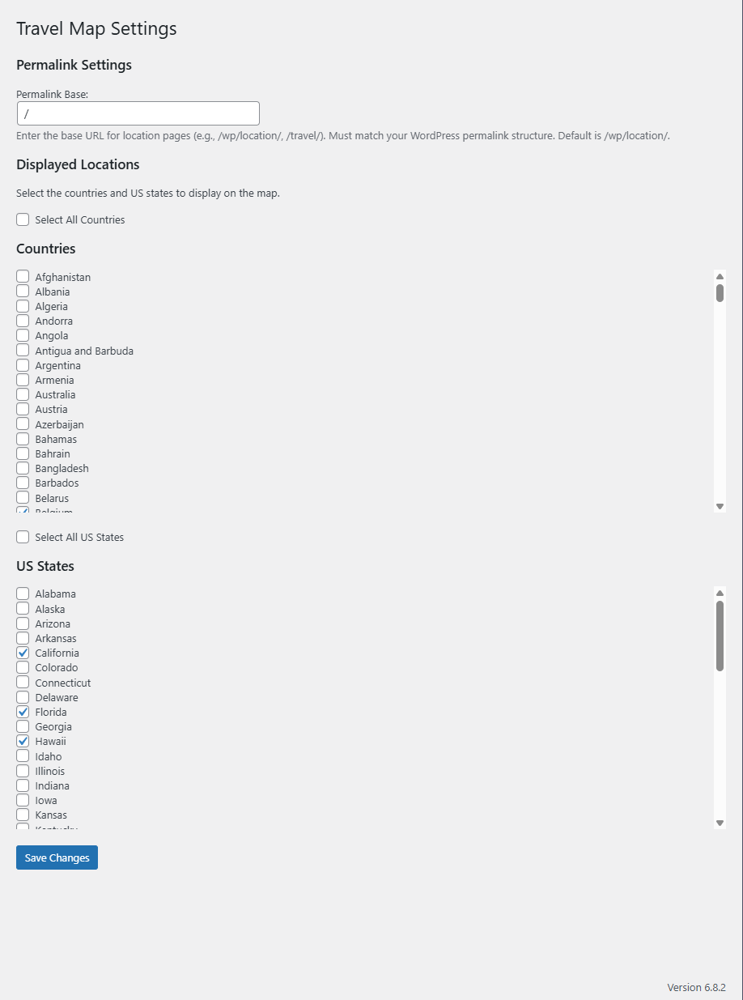
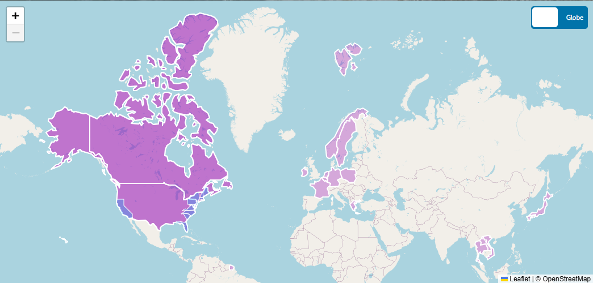
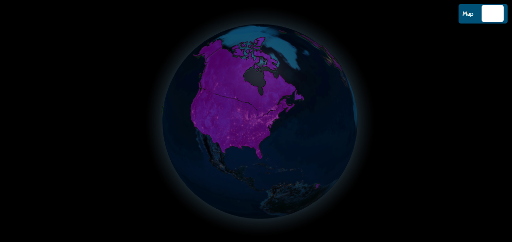

# Travel Map Widget

A WordPress plugin that adds an interactive travel map widget to your website, featuring a toggle between a flat map and a 3D globe. Users can manage displayed countries and US states via a settings page and customize the permalink structure for location pages.

- **Plugin Name**: Travel Map Widget
- **Version**: 1.0.0
- **Author**: Tony Cicero
- **License**: GPL v2 or later
- **Requires at least**: WordPress 6.0
- **Tested up to**: WordPress 6.6
- **Requires PHP**: 7.4 or higher
- **Tags**: map, travel, widget, leaflet, globe, interactive

## Description

The Travel Map Widget allows you to embed an interactive map on your WordPress site, highlighting selected countries and US states. It uses Leaflet for the flat map and Globe.GL with Three.js for the 3D globe view. Features include a toggle switch, transparent polygons, clickable locations linking to custom permalinks, and a settings page to manage locations and permalink structure.

## Installation

1. **Download the Plugin**:
   - Clone or download this repository: `git clone https://github.com/TonyCicero/travel-map-widget.git`
   - Alternatively, download the ZIP file and extract it.

2. **Upload to WordPress**:
   - Upload the contents of `travel-map-widget/WordPress` folder to the `wp-content/plugins/travel-map-widget` directory of your WordPress installation.
   - Or, go to **WP Admin > Plugins > Add New > Upload Plugin**, select the ZIP file, and install.

3. **Activate the Plugin**:
   - Navigate to **WP Admin > Plugins** and activate the "Travel Map Widget" plugin.

4. **Configure Settings**:
   - Go to **Settings > Travel Map** in the WordPress admin panel.
   - Set the **Permalink Base** (default: `/wp/location/`) to match your desired URL structure (e.g., `/travel/`).
   - Check the boxes for countries and US states to display on the map.
   - Use the "Select All Countries" or "Select All US States" options for bulk selection.
   - Click **Save Changes**.

5. **Add the Widget**:
   - Add the shortcode `[travel_map]` to any page or post using the Gutenberg editor, Classic Editor, or a Custom HTML block.

6. **Optional GeoJSON Hosting**:
   - The plugin uses external GeoJSON files:
     - Countries: [world.geo.json](https://raw.githubusercontent.com/TonyCicero/Travel-Map-Widget/refs/heads/main/world.geo.json)
     - US States: [us_states.geo.json](https://raw.githubusercontent.com/Travel-Map-Widget/refs/heads/main/us_states.geo.json)
   - For better reliability, upload these files to your WordPress media library (e.g., `/wp-content/uploads/2025/08/world.geo.json`) and update the URLs in `travel-map-widget.php`.

7. **Create Location Pages**:
   - Create WordPress pages matching the permalink structure (e.g., `/wp/location/united-states`, `/wp/location/california`).
   - Flush permalinks (Settings > Permalinks > Save Changes) to apply the structure.

## Usage

- **Embed the Map**: Use `[travel_map]` in a page or post to display the widget.
- **Toggle Views**: Click the toggle switch to switch between the flat map and 3D globe.
- **Interact**: Click on highlighted locations to navigate to their respective pages (e.g., `/wp/location/california`).
- **Customize**: Adjust the permalink base and selected locations via the settings page.

## Features

- **Interactive Map**: Displays a flat map (via Leaflet) and a 3D globe (via Globe.GL).
- **Location Management**: Checkbox interface in settings to select countries and US states.
- **Configurable Permalinks**: Customize the URL structure (default: `/wp/location/[slug]`).
- **Transparent Polygons**: Visually appealing with adjustable opacity.
- **Error Handling**: Displays errors if GeoJSON fails to load or no locations match.
- **Responsive Design**: Works on various screen sizes.

## Screenshots

- **Settings Page**: Shows the checkbox interface and permalink input.
  
- **Flat Map View**: Displays selected locations on a tiled OpenStreetMap base.
  
- **Globe View**: Renders a 3D globe with highlighted countries.
  

## Changelog

- **1.0.0**:
  - Initial release.

## License

This plugin is licensed under the GPL v2 or later. See the [LICENSE](LICENSE) file for details.

## Support

For issues or questions, please:
- Open an issue on this GitHub repository.
